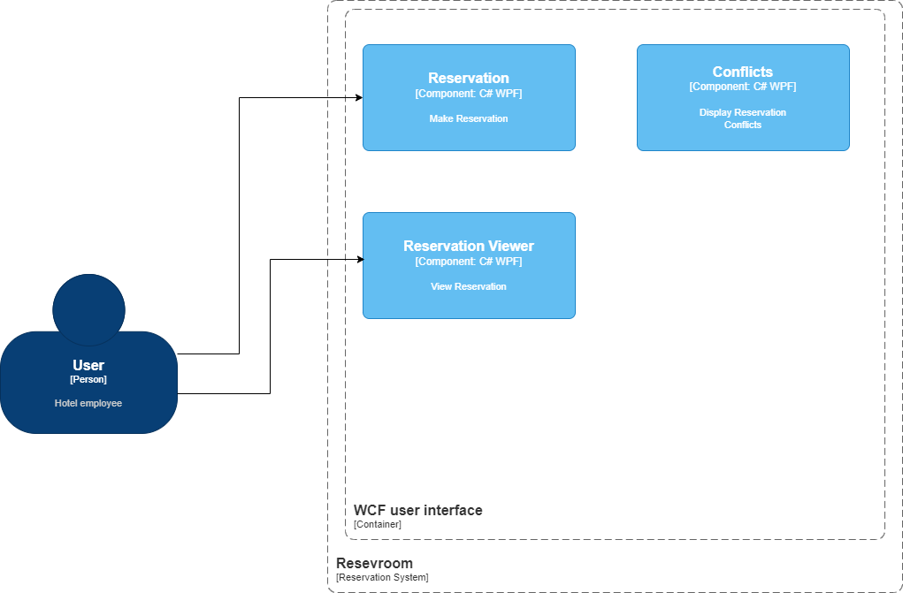

# WPF application

To demonstrate a new WPF component for my work, I followed a tutorial available on YouTube.

[SingletonSean - Models - WPF MVVM TUTORIAL #1](https://www.youtube.com/watch?v=fZxZswmC_BY)

* I highly recommend this tutorial, as it thoroughly establishes a credible model before progressing to the associated views.
* The View design serves as an excellent introduction to XAML, covering grid layouts, padding, margins, shared sizes, and (keyed) styles.
* The creation of the ViewModels shows bindings, UpdateSourceTrigger.
* Creation of Commands, that are objects parts of the ViewModel layer and an abstraction of buttons for examples, that can be grayed or not depending of the context.
    * Models are injected in the Command button in order to interact with it.
* Navigation, and an introduction to Stores, objects that maintains the state of the application.
    * Stores are declared at the App level.   
    * Stores are injected in the ViewModels and in Navigation Commands. 
    * Changes in stores need to be relayed to the ViewModel that can trigger the OnPropertyChanged method (PropertyChangedEventHandler event part of INotifyPropertyChanged)

Below the domain presented in the video.

I used Mermaid to build this diagram.

::: mermaid
classDiagram
    Hotel "1" --> "1" ReservationBook : owns
    ReservationBook "1" --> "*" Reservation : registers
    Reservation "1" --> "1" RoomID : for
::: 

::: mermaid
classDiagram
    class MyViewModel {
        - string Property1
        - string Property2
        + void SubmitCommand()
        + void CancelCommand()
    }
    class SubmitCommand {
        + void Execute()
        + bool CanExecute()
    }
    class CancelCommand {
        + void Execute()
        + bool CanExecute()
    }
    class NavigationStore {
        - MyViewModel CurrentViewModel
    }
    MyViewModel "1" --> "1" SubmitCommand : uses
    MyViewModel "1" --> "1" CancelCommand : uses
    NavigationStore "1" --> "1" MyViewModel : holds
:::
